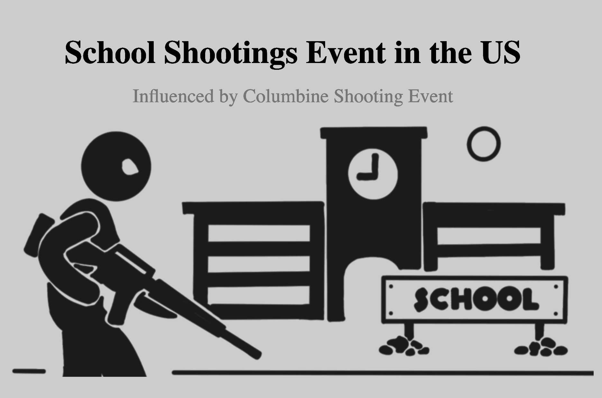
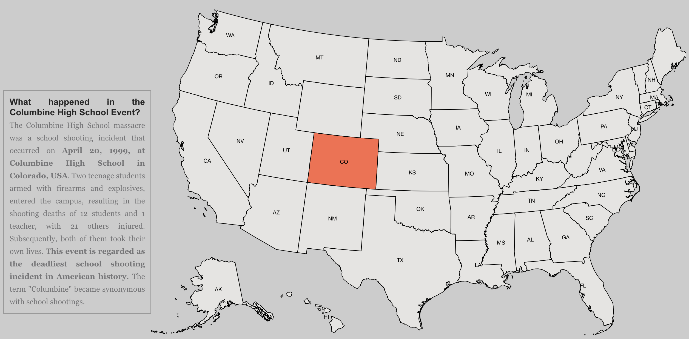
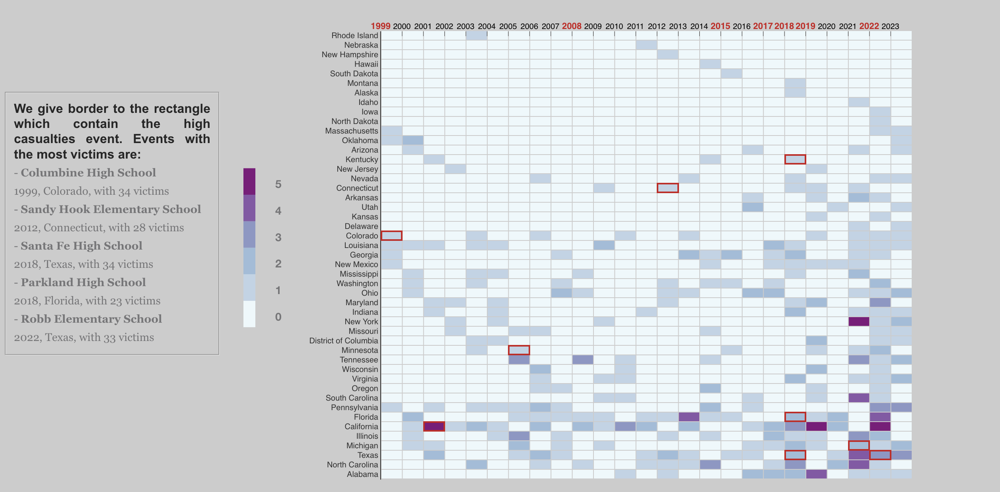
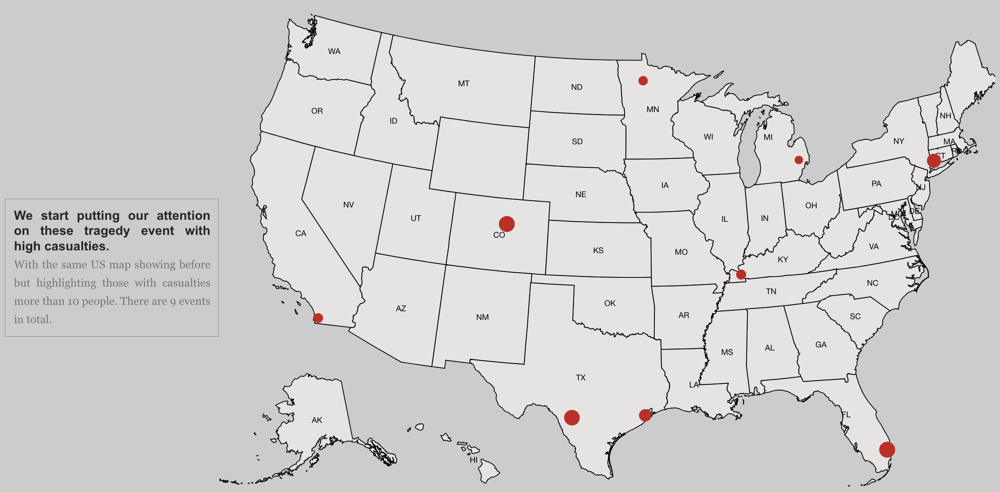
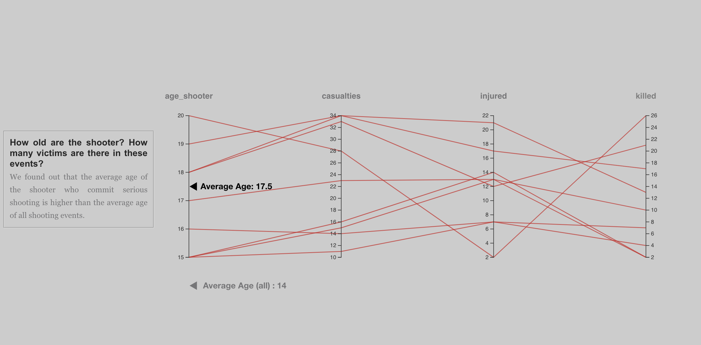
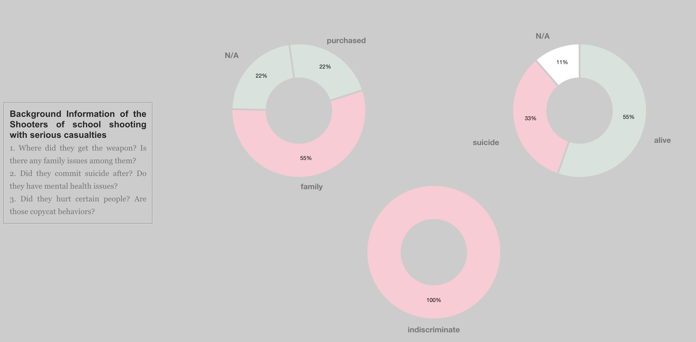

## Introduction: Data Scrollytelling

The system visualizes School Shootings Influenced by <em>Columbine Shooting Event</em> in the US.
A <code>story-telling</code> design is used for user to scroll down and see the story by our designed flow.
In addition to common charts, we annotate each section with text snippets scraped from web articles as descriptions of the gun culture in the US impact on the school shooting events.
Using tempelate from https://github.com/vlandham/scroll_demo/tree/gh-pages and picture from https://www.iconfinder.com/icons/2131923/gun_killing_school_shooting_terrorism_terrorist_war_icon

## Data set
### Kaggle
Dataset:  [School Shootings](https://www.kaggle.com/datasets/joebeachcapital/school-shootings)
Publicly available on Kaggle. 

### About the Dataset
The data set provides a lot of information about the school shootings, but it does not provide information on the events related to guns and how it impacts the school shooting events. 
We address this problem by collecting text snippets regarding to a school shooting event from web articles.
The scraped dataset consists of different stages of events related to guns and stage descriptions in plain texts. 
We further related a stage for school shooting events and extract a short summary for each stage descriptions.

The layout is divided into two main sections:
- Overview of the whole dataset.
- Analysis of top 9 serious events. (The number of casualties > 10)

## Visualization: Overview of the whole dataset
The overview starts with a page briefly introducing the *Columbine Shooting Event* as shown in the figure.

Once the user enter the section, a `story-telling` visualization is shown where each section represents a part of our story.



In the beginning, we'll show three `geographical maps` of the United States. In the first map, the state where Columbine Shooting Event occurred will be colored orange. The second map with different dots scattered around, each dot representing a school shooting event. For the last map, we show the states that have high occurrences over 10 shooting events from 1999 to 2023.

Then we'll dig into the gun culture in the US and show the relationship between the gun culture and the dataset in `heatmap`. However, we found that the changes in gun culture are related to the number of casualties of school shooting events rather than the frequency of school shooting events.


Therefore, we'll enter the next part that filtered the dataset into the events which the number of the casualties are over 10.




## Visualization: The Analysis of Top 9 Serious Events

As the user scrolls down and enter into later stages, more information are shown by the analysis of top 9 serious events.
Additionally, we are curious about the shooters' age and backgrounds who cause the top 9 serious school shooting events in the US from 1999 to 2023.

We first analyze a `parallel chart` to see the shooter's age and the casualties he/she caused. The average age of shooters in the whole dataset is 14. However, we found that the shooters' ages in the serious events are higher than the average age in the dataset.

In addition, we then draw three pie charts to show the background of the shooters, including their weapon source, did they commit suicide after the shooting events, and did they shoot targeted person.


## Environment Setup

### Frontend
Frontend uses `Vue` + `vite`.
Navigate to project directory and run:
```shell
npm i 
npm run dev
```
The default server address is `localhost:3000`. 


